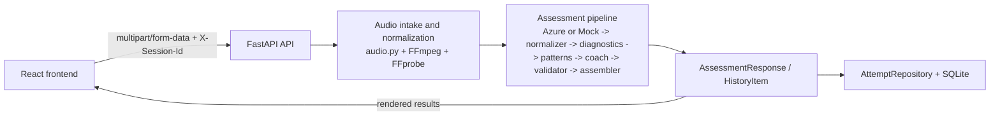
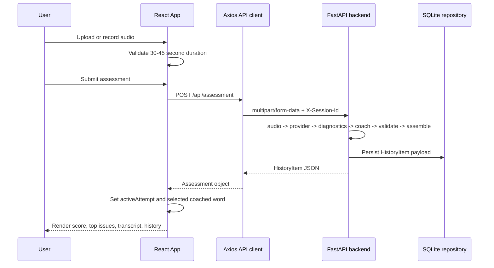

# PronounceAI

PronounceAI is a full-stack pronunciation assessment app for short English recordings. It supports browser recording, file upload, word-level issue highlighting, AI coaching, anonymous session history, and DPDP-aware data handling.

## Stack

- Frontend: React, TypeScript, Vite, TanStack Query, Axios
- Backend: FastAPI, SQLAlchemy, Pydantic Settings
- Audio pipeline: FFmpeg / FFprobe
- Providers: Azure Speech, Groq, database via `DATABASE_URL`

## High-Level Architecture



## Frontend Rendering Flow




## Local Setup

### Frontend

```powershell
cd frontend
npm install
npm run dev
```

### Backend

```powershell
python -m venv .venv
.\.venv\Scripts\Activate.ps1
pip install -r backend\requirements.txt
uvicorn backend.app.main:app --reload --host 0.0.0.0 --port 8000
```

## Environment

Copy `.env.example` to `.env` and fill in values. The backend runs in mock mode by default so the product can work end-to-end before Azure or Groq keys are added.

For the real provider path:

- Set `ENABLE_MOCK_ANALYSIS=false`
- Add Azure Speech and Groq keys to `.env`

## Notes

- FFmpeg and FFprobe should be available on the server `PATH`
- Raw audio is written to temp storage only for processing and deleted afterwards
- Attempt history retains transcripts, scores, and coaching payloads for up to 90 days by default
- Azure Speech is configured for Central India via `AZURE_SPEECH_REGION=centralindia`
- Groq receives transcript and diagnostic context for coaching-text generation and should be disclosed as a separate processor in privacy/compliance materials
